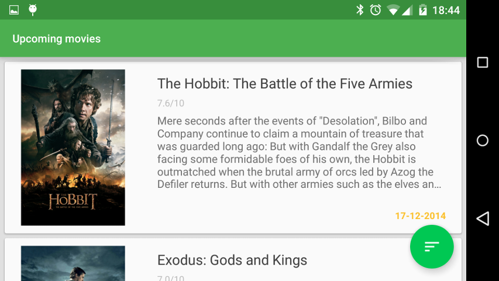

 Upcoming movies MVP
=========

[](https://travis-ci.org/jlmd/UpcomingMoviesMVP)
[](https://android-arsenal.com/details/3/1516)
 
 Project created for autolearning where I try to apply the new **Material Design** and Android good practices to develop a **MVP (Model View Presenter)** application using a mocked list of **upcoming movies** as the domain of the application.
 
Motivation
----
After see the MVP implementations of:

- [MVPCleanArchitecture](https://github.com/glomadrian/MvpCleanArchitecture) by [glmoadrian](https://github.com/glomadrian)
- [EffectiveAndroidUI](https://github.com/pedrovgs/EffectiveAndroidUI) by [pedrovgs](https://github.com/pedrovgs)

I decided to make my own implenentation using these two projects as reference.
 
Libraries used
----

- [Dagger](http://square.github.io/dagger/)
- [Retrofit](http://square.github.io/retrofit/)
- [ButterKnife](http://jakewharton.github.io/butterknife/)
- [FloatingActionButton](https://github.com/makovkastar/FloatingActionButton)
- [Picasso](http://square.github.io/picasso/)
- [Otto](http://square.github.io/otto/)

Screenshots
----
 




Developed by
---
José Luis Martín - <joseluis.martind@gmail.com>

* [LinkedIn](https://www.linkedin.com/in/jlmartind)
* [Twitter](https://twitter.com/jlmartind)

License
----
```
Copyright 2014 José Luis Martín

Licensed under the Apache License, Version 2.0 (the "License");
you may not use this file except in compliance with the License.
You may obtain a copy of the License at

   http://www.apache.org/licenses/LICENSE-2.0

Unless required by applicable law or agreed to in writing, software
distributed under the License is distributed on an "AS IS" BASIS,
WITHOUT WARRANTIES OR CONDITIONS OF ANY KIND, either express or implied.
See the License for the specific language governing permissions and
limitations under the License.
```
